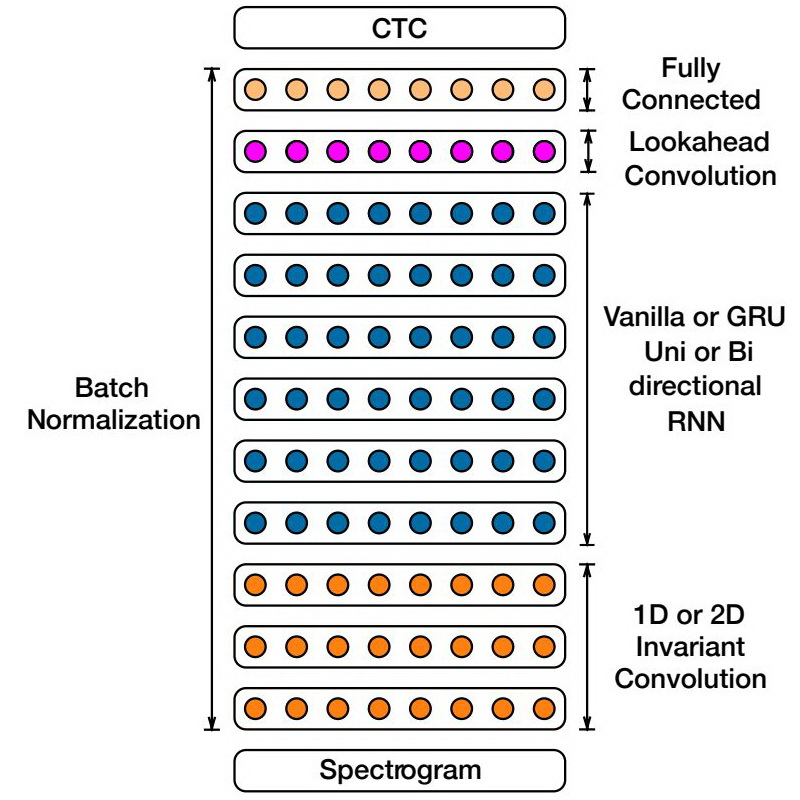
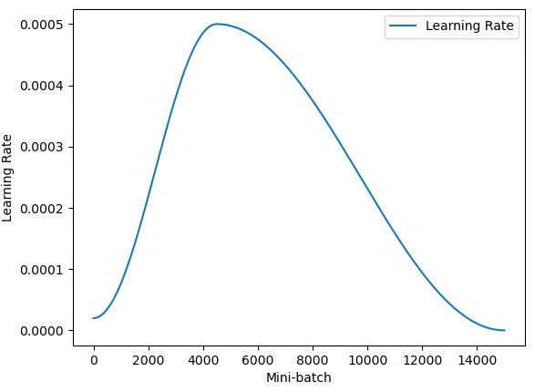
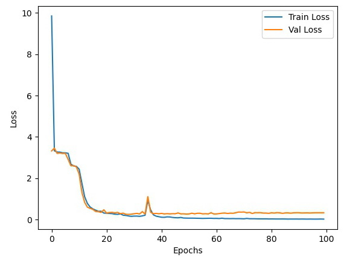
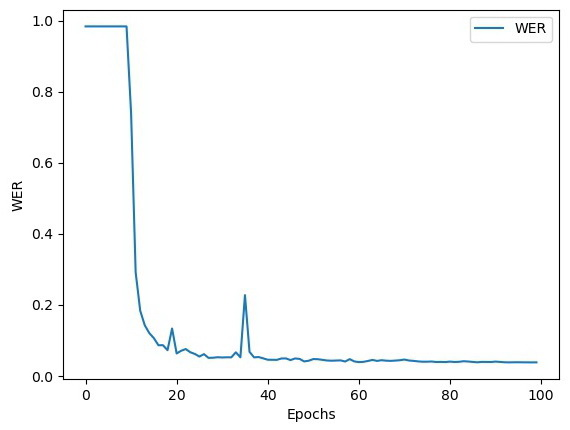

# Speech_Recognition-PyTorch
 
#### 此程式碼由本人獨自閱讀參考文獻撰寫，部分程式碼來自參考文獻中，並感謝@[Yu-Jie Chou, JerryJack121](https://github.com/JerryJack121)在語音預處理提供協助，更完整原始碼請至本人之個人GitHub網站@[Chen-Yen Chang, BlackyYen](https://github.com/BlackyYen)下載。
#### 程式碼與以下圖片部分是引用自參考文獻，如有侵權請立即告知，會立即刪除。謝謝您！

## 目錄

1. [Kaggle結果](#Kaggle結果)
2. [資料預處理](#資料預處理)
3. [模型架構](#模型架構)
4. [訓練設置](#訓練設置)
5. [結果分析](#結果分析)
6. [參考資料](#參考資料)

## Kaggle結果

1. 在Kaggle競賽表現上公眾排行榜拿到了第二名3.41747分。 
 
2. 在Kaggle競賽表現上私人排行榜拿到了第一名2.83127分。 
 

## 資料預處理

1. 首先建立字串字典，並利用切割方法將英文字母與相對應的數字加入至char_map與index_map清單中。
```
class TextTransform:
    """Maps characters to integers and vice versa"""
    def __init__(self):
        char_map_str = """
        ' 0
        &lt;space&gt; 1
        a 2
        b 3
        c 4
        d 5
        e 6
        f 7
        g 8
        h 9
        i 10
        j 11
        k 12
        l 13
        m 14
        n 15
        o 16
        p 17
        q 18
        r 19
        s 20
        t 21
        u 22
        v 23
        w 24
        x 25
        y 26
        z 27
        """
        self.char_map = {}
        self.index_map = {}
        for line in char_map_str.strip().split('\n'):
            ch, index = line.split()
            self.char_map[ch] = int(index)
            self.index_map[int(index)] = ch
        self.index_map[1] = ' '
```
2. 建立編碼與解碼的函式。
```
# 文字轉數字
def text_to_int(self, text):
    """ Use a character map and convert text to an integer sequence """
    int_sequence = []
    for c in text:
        if c == ' ':
            ch = self.char_map['&lt;space&gt;']
        else:
            ch = self.char_map[c]
        int_sequence.append(ch)
    return int_sequence
# 數字轉文字
def int_to_text(self, labels):
    """ Use a character map and convert integer labels to an text sequence """
    string = []
    for i in labels:
        string.append(self.index_map[i])
    return ''.join(string)
```
3. 在訓練之前要先刪除過長之音檔，本次訓練刪除30秒以上之音檔，如下所示。
```
filelist = os.listdir(path)
for filename in (filelist):
    file_path = os.path.join(path, filename)
    y, sr = librosa.load(file_path)
    duration = librosa.get_duration(y, sr)
    # 刪除長度超過30秒之音檔
    if duration > 30:
        filepath = os.path.join(path, filename)
        os.remove(filepath)
```
4. 讀取資料包括獲取音檔之波型圖，固定長度，詳細原始碼請至utils/audio_dataloader.py查閱。
## 模型架構

1. 這次使用的語音模型架構為DeepSpeech2，示意圖如下圖所示，包含了CNN、BiGRU、Fully Connected等，詳細原始碼在net/model.py。 
 
## 訓練設置

1. 模型參數設置
```
"n_cnn_layers": 3
"n_rnn_layers": 7
"rnn_dim": 1024
"n_class": 29
"n_feats": 128
"stride": 2
"dropout": 0.1
```
2. 訓練參數設置如下所示。
```
learning_rate =  5e-4
batch_size = 20
epochs = 100
```
 
## 結果分析

1. 訓練總Epochs為100，從整個Loss取線上可以明顯地看到，在接近40步的時候產生過度擬合的現象，Train Loss不斷的下降，但Val Loss趨於平緩，不過這個到對測試沒有太大的影響，因為在訓練的時候有使用dropout，在測試的時候會把dropout關閉，會明顯解決過度擬合的情況發生。
 
2. 儘管Val Loss趨於平緩，沒有下降的趨勢，但從WER的曲線上可以看到是一直在下降的，而在第99 Epoch中，WER更是降到了最低點0.0384。  
 
## 參考資料

#### [1] Deep Speech 2 : End-to-End Speech Recognition in English and Mandarin @[Amodei, D., Ananthanarayanan, S., Anubhai, R., Bai, J., Battenberg, E. et al..](ht## [2] pytorch載入語音類自定義資料集 @[sddin@qq.com](https://www.it145.com/9/56376.html)
#### [3] 利用 AssemblyAI 在 PyTorch 中建立端到端的語音識別模型 @[Comet](https://cloud.tencent.com/developer/article/1645492)
#### [4] 編輯距離WER/CER計算的一種python實現 @[zwglory](https://blog.csdn.net/baobao3456810/article/details/107381052)
#### [5] HResults計算字錯率(WER)、句錯率(SER) @[Findyou](https://www.cnblogs.com/findyou/p/10646312.html) 
#### [6] 語音識別CER計算 @[Jack](https://zhuanlan.zhihu.com/p/114414797) 
#### [7] Model training with automatic mixed precision is not learning @[Michael Nguyen, miken](https://discuss.pytorch.org/t/model-training-with-automatic-mixed-precision-is-not-learning/75756) 
